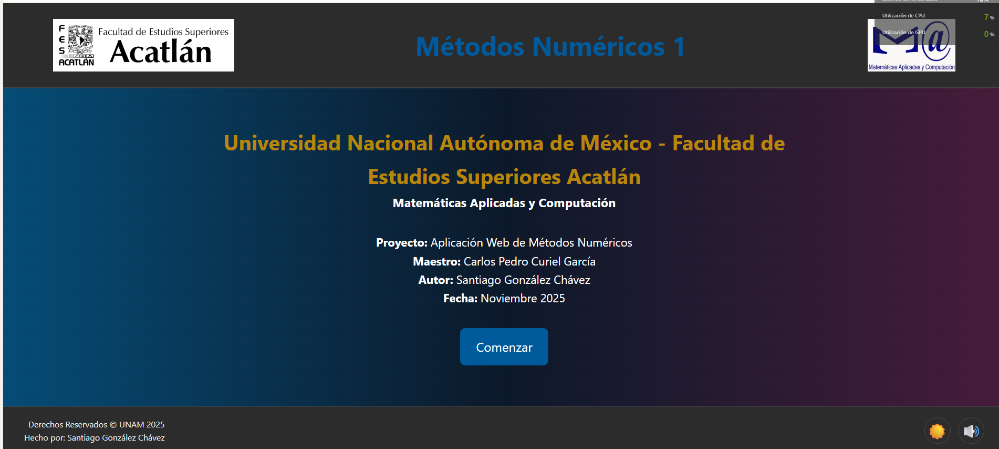

# 💻 Proyecto: Aplicación Web de Métodos Numéricos 1

¡Hola! Soy **Santiago González Chávez**, estudiante de Matemáticas Aplicadas y Computación en la UNAM FES Acatlán.

Este es mi proyecto final para la materia de Métodos Numéricos 1. En lugar de solo entregar un trabajo escrito, decidí construir una **aplicación web interactiva, moderna y funcional** que no solo resuelve los problemas, sino que también sirve como una herramienta de estudio para cualquiera que quiera visualizar estos conceptos en acción.

**[¡Ver el sitio en vivo!]( https://santiagoglezch7.github.io/web_metodos_numericos/   )** 🚀


---

### 📸 Vistazo del Proyecto

Aquí incluyo una captura representativa del sitio para que puedas ver la apariencia y navegación.



---

## 🧠 Mi Objetivo con este Proyecto

Mi objetivo principal era desmitificar los métodos numéricos. Como estudiante, sé que las fórmulas pueden parecer abstractas en un pizarrón. Quería crear un "laboratorio digital" donde mis compañeros y yo pudiéramos:

* Visualizar el "paso a paso" de los algoritmos iterativos.
* Comprobar resultados de tareas y ejercicios de forma rápida.
* Entender la convergencia viendo cómo el error disminuye en cada iteración.
* Construir un portafolio profesional que demuestre mi habilidad para aplicar la matemática y la programación en un producto real y útil.

---

## ✨ Características Principales

Esta aplicación web fue construida desde cero y cuenta con:

* **4 Módulos Principales:** Cubriendo todo el temario de la materia.
* **Calculadoras Interactivas:** El usuario puede usar los problemas de ejemplo que programé.
* **Tablas de Resultados:** Cada método iterativo (como Jacobi o Newton) muestra una tabla completa con cada iteración, el valor encontrado y el error absoluto.
* **Teoría Detallada:** Cada sección y método incluye una introducción teórica en primera persona, explicando el "por qué" y el "cómo" del algoritmo.
* **Renderizado de Fórmulas (MathJax):** ¡Adiós al texto plano! Todas las fórmulas matemáticas se renderizan profesionalmente usando LaTeX y la librería MathJax.
* **Modo Oscuro/Claro:** Un interruptor ☀️/🌙 para cuidar la vista durante esas largas noches de estudio.
* **Diseño Moderno:** Una interfaz limpia, profesional y totalmente adaptable a dispositivos móviles (responsive).

---

## 🛠️ Stack Tecnológico

Para este proyecto, decidí enfocarme en las bases del desarrollo web, sin frameworks, para tener un control total:

* **HTML5:** Para la estructura semántica de todo el sitio.
* **CSS3:** Para todo el diseño, usando Flexbox y variables CSS para el modo oscuro y el degradado.
* **JavaScript (ES6+):** ¡El cerebro de toda la operación! Todo el "backend" matemático (los algoritmos de Newton, Cholesky, Gauss-Seidel, etc.) corre en el navegador del cliente. También maneja la interactividad del DOM, el sonido y el modo oscuro.
* **MathJax (Local):** La librería para renderizar hermosas fórmulas matemáticas. La incluí localmente en el proyecto para asegurar que funcione incluso si los servidores externos (CDN) fallan.

---

## 📂 Estructura del proyecto

Organización clara y legible del repositorio. Los nombres indican la función de cada archivo o carpeta.

- / (raíz del proyecto)
    - `index.html` — Portada principal
    - `introduccion.html` — Página con mi foto y la introducción
    - `menu.html` — Menú principal con los 4 módulos
    - `README.md` — Documentación (este archivo)
    - `.gitignore` — Reglas de ignorado (por ejemplo: `img/`)

- /css/
    - `style.css` — Hoja de estilos principal

- /js/
    - `main.js` — Lógica de UI (modo oscuro, sonido, botones)
    - `calculos.js` — Implementación de los métodos numéricos
    - `/mathjax/` — MathJax local (si lo incluyes)

- /img/
    - `logo-unam.png`
    - `logo-fes.png`
    - `santiago-gonzalez.jpg` — foto personal (recomendado: no subirla al repositorio)

- /audio/
    - `intro-sound.mp3`

- /metodos/
    - /1-ecuaciones-no-lineales/
        - `index.html`
        - `biseccion.html`
        - `newton.html`
        - `secante.html`

    - /2-sistemas-ecuaciones-lineales/
        - `index.html`
        - `gauss-jordan.html`
        - `jacobi.html`
        - `gauss-seidel.html`

    - /3-factorizacion-lu/
        - `index.html`
        - `crout.html`
        - `cholesky.html`

    - /4-valores-vectores-propios/
        - `index.html`
        - `potencia.html`
        - `potencia-inversa.html`
---

## 🚀 Cómo correr el proyecto localmente

A continuación detallo los pasos que uso para ejecutar el sitio en mi máquina de desarrollo. El contenido listo para servir está dentro de la carpeta `programa` del repositorio.

1. **Clona el repositorio**

    ```bash
    git clone https://github.com/SantiagoGlezCh7/web_metodos_numericos.git
    ```

2. **Entra en la carpeta del sitio**

    ```bash
    cd web_metodos_numericos/programa
    ```

3. **Abre el proyecto en VS Code** (opcional, recomendado)

    ```bash
    code .
    ```

4. **Sirve el sitio**

    - Opción A — Live Server (recomendada):
      * Instala la extensión *Live Server* en VS Code.
      * Haz clic derecho sobre `index.html` (dentro de la carpeta `programa`) y selecciona *Open with Live Server*.

    - Opción B — Servidor simple con Python (funciona sin extensiones):

    ```powershell
    # Desde la carpeta 'programa'
    python -m http.server 5500
    # Abrir en el navegador:
    http://localhost:5500/index.html
    ```


¡Gracias por visitar mi proyecto!

---

Hecho con ❤️ y mucho ☕ por **Santiago González Chávez**.
